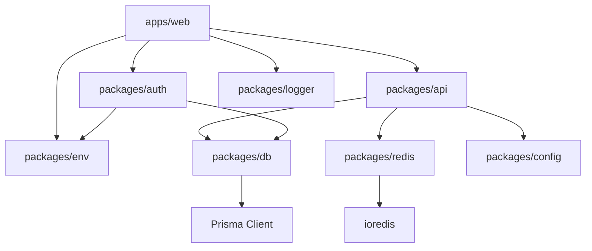
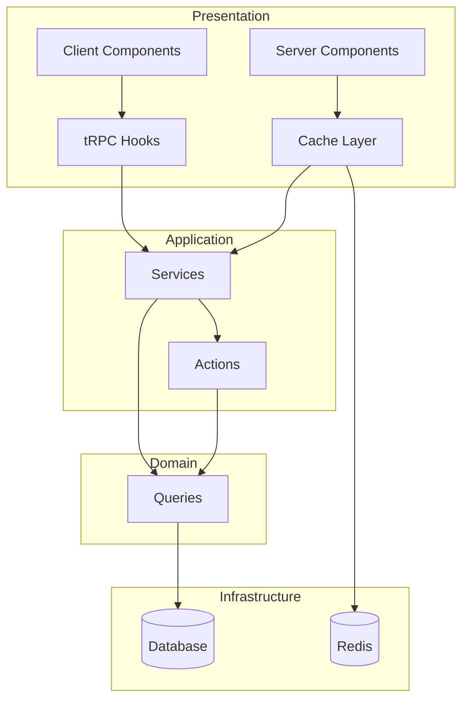

# 🏥 Smart Clinic - Pediatric Management System
## Complete Architecture & Implementation Guide

---

## 📋 **Table of Contents**
1. [Project Overview](#project-overview)
2. [Technology Stack](#technology-stack)
3. [Monorepo Architecture](#monorepo-architecture)
4. [Package Structure](#package-structure)
5. [Core Patterns & Best Practices](#core-patterns--best-practices)
6. [Database Schema & Prisma v7](#database-schema--prisma-v7)
7. [tRPC v11 Implementation](#trpc-v11-implementation)
8. [Next.js 16 App Router](#nextjs-16-app-router)
9. [Caching Strategy](#caching-strategy)
10. [Authentication with Better-Auth](#authentication-with-better-auth)
11. [Pediatric-Specific Modules](#pediatric-specific-modules)
12. [Performance Optimization](#performance-optimization)
13. [Development Workflow](#development-workflow)
14. [Deployment Strategy](#deployment-strategy)
15. [Monitoring & Observability](#monitoring--observability)

---

## 🎯 **Project Overview**

**Smart Clinic** is a comprehensive pediatric clinic management system built with modern web technologies. It handles patient records, appointments, growth tracking (WHO standards), immunizations, prescriptions, billing, and clinic administration.

### **Key Features**
- 👶 Pediatric-specific growth charts (WHO standards)
- 💉 Immunization tracking & schedules
- 📋 Medical records with SOAP notes
- 📅 Appointment scheduling
- 💊 Prescription management with pediatric dosing
- 🏥 Multi-clinic support (tenant isolation)
- 👥 Role-based access (Admin, Doctor, Staff, Patient)
- 📊 Analytics dashboards
- 🔔 Real-time notifications
- 💳 Payment processing

---

## 🛠️ **Technology Stack**

### **Core Framework**
| Technology | Version | Purpose |
|------------|---------|---------|
| Next.js | 16.0.0 | React framework with App Router |
| React | 19.2.0 | UI library |
| TypeScript | 5.8.2 | Type safety |
| pnpm | 1.2.4 | JavaScript runtime & package manager |

### **Backend & Data**
| Technology | Version | Purpose |
|------------|---------|---------|
| Prisma | 7.0.0 | ORM with driver adapters |
| PostgreSQL | 16 | Primary database |
| Redis | 7.4 | Caching, queues, rate limiting |
| tRPC | 11.0.0 | End-to-end typesafe APIs |
| Better-Auth | 1.2.0 | Authentication |

### **Validation & Schema**
| Technology | Version | Purpose |
|------------|---------|---------|
| Zod | 3.24.2 | Runtime validation |
| @repo/db | - | Shared Prisma client & schemas |
| @repo/env | - | Type-safe environment variables |

### **UI & Styling**
| Technology | Version | Purpose |
|------------|---------|---------|
| Tailwind CSS | 4.0.14 | Styling |
| shadcn/ui | 2.4.0 | Component library |
| Radix UI | Latest | Headless components |
| Lucide React | Latest | Icons |

### **Tooling & Quality**
| Technology | Version | Purpose |
|------------|---------|---------|
| Biome | 1.9.4 | Linting & formatting |
| Lefthook | 1.11.3 | Git hooks |
| Knip | Latest | Dead code detection |

---

## 🏗️ **Monorepo Architecture**

```
smart-turbo/
├── apps/
│   └── web/                 # Main Next.js application
├── packages/
│   ├── api/                 # tRPC routers & server logic
│   ├── auth/                 # Authentication & roles
│   ├── config/               # Shared configurations
│   ├── db/                   # Prisma schema & database layer
│   ├── env/                   # Type-safe environment variables
│   ├── logger/               # Structured logging
│   └── redis/                # Redis client & utilities
├── turbo.json                 # Turborepo pipeline
├── biome.json                 # Biome configuration
├── lefthook.yml               # Git hooks
└── package.json               # Workspace configuration
```

### **Package Relationships**



---

## 📦 **Package Deep Dive**

### **1. @repo/db - Database Layer**

**Purpose**: Centralized Prisma ORM with query utilities

```typescript
// packages/db/src/index.ts
export * from './queries';
export * from './schemas';
export * from './utils';
export { prisma } from './client';
```

**Key Files**:
- `prisma/schema/` - Modular schema files
  - `auth.prisma` - Authentication models
  - `clinic.prisma` - Clinic, Doctor, Staff
  - `patient.prisma` - Patients, guardians
  - `medical.prisma` - Records, diagnoses
  - `view.prisma` - Materialized views
- `src/queries/` - Pure database queries (no business logic)
- `src/schemas/` - Zod validation schemas
- `src/utils/` - Helper functions (age calc, dose calc, etc.)

### **2. @repo/api - tRPC & Server Logic**

**Purpose**: All server-side logic following clean architecture

```
packages/api/src/
├── actions/          # Server Actions (thin auth + validation)
├── cache/            # Cache layer with 'use cache'
│   └── utils/        # Cache tags, profiles, helpers
├── routers/          # tRPC routers (optional)
├── services/         # Business logic layer
└── utils/            # Shared utilities
```

### **3. @repo/redis - Caching & Real-time**

**Purpose**: Redis client with typed utilities

```typescript
// packages/redis/src/index.ts
export * from './cache';      // Cache helpers
export * from './pubsub';     // Real-time events
export * from './queue';      // Background jobs
export * from './rate-limit'; // Rate limiting
export * from './session';    // Session storage
```

### **4. @repo/logger - Structured Logging**

**Purpose**: Centralized logging with multiple transports

```typescript
// packages/logger/src/index.ts
export const logger = {
  info: (msg, meta) => {...},
  error: (msg, error, meta) => {...},
  warn: (msg, meta) => {...},
  debug: (msg, meta) => {...},
  
  // Child logger with context
  child: (context) => {...}
};
```

### **5. @repo/auth - Authentication & Authorization**

**Purpose**: Better-Auth integration with role management

```typescript
// packages/auth/src/roles.ts
export type UserRole = 'ADMIN' | 'DOCTOR' | 'STAFF' | 'PATIENT';

export const permissions = {
  'ADMIN': ['*'],  // Full access
  'DOCTOR': ['patient:read', 'patient:write', 'prescription:*'],
  'STAFF': ['patient:read', 'appointment:write'],
  'PATIENT': ['self:read']
} as const;
```

---

## 🧠 **Core Patterns & Best Practices**

### **Clean Architecture Layers**



### **File Responsibility Matrix**

| Layer | File Pattern | Responsibility | Forbidden |
|-------|--------------|----------------|-----------|
| **Query** | `*.query.ts` | Raw Prisma queries | Business logic, Cache, Auth |
| **Cache** | `*.cache.ts` | `'use cache'` directives | Prisma, Business logic |
| **Service** | `*.service.ts` | Business logic | Prisma, `'use cache'` |
| **Action** | `*.action.ts` | Auth + Validation | Prisma, Business logic |
| **Router** | `*.router.ts` | tRPC route definitions | Database logic |

### **Example: Patient Module**

```typescript
// 1. QUERY LAYER - @repo/db/queries/patient.query.ts
export const patientQueries = {
  findById: dedupeQuery((id: string) => 
    prisma.patient.findUnique({ where: { id } })
  )
};

// 2. CACHE LAYER - @repo/api/cache/patient.cache.ts
'use cache';
export async function getCachedPatient(id: string) {
  cacheTag(CACHE_TAGS.patient.byId(id));
  cacheLife(CACHE_PROFILES.medicalShort);
  return patientService.getPatientById(id);
}

// 3. SERVICE LAYER - @repo/api/services/patient.service.ts
export class PatientService {
  async getPatientById(id: string) {
    return patientQueries.findById(id);
  }
}

// 4. ACTION LAYER - @repo/api/actions/patient.action.ts
'use server';
export async function getPatientAction(id: string) {
  const session = await auth();
  if (!session) throw new Error('Unauthorized');
  return patientService.getPatientById(id);
}

// 5. ROUTER LAYER - @repo/api/routers/patient.router.ts
export const patientRouter = router({
  getById: protectedProcedure
    .input(z.object({ id: z.string() }))
    .query(({ input }) => patientService.getPatientById(input.id))
});
```

---

## 📊 **Database Schema & Prisma v7**

### **Prisma v7 Configuration**

```prisma
// packages/db/prisma/schema/schema.prisma
generator client {
  provider               = "prisma-client"
  output                 = "./generated"
  moduleFormat           = "esm"
  engineType             = "client"
  runtime                = "pnpm"
  previewFeatures        = ["views", "relationJoins", "postgresqlExtensions"]
}

datasource db {
  provider = "postgresql"
  // No URL - configured in prisma.config.ts
}
```

### **prisma.config.ts**

```typescript
// packages/db/prisma.config.ts
import 'dotenv/config';
import { defineConfig } from 'prisma/config';

export default defineConfig({
  schema: 'prisma/schema/schema.prisma',
  migrations: {
    path: 'prisma/migrations',
    seed: 'tsx prisma/seed.ts',
  },
  datasource: {
    url: process.env.DATABASE_URL!,
  },
});
```

### **Core Models**

```prisma
// Simplified model relationships
model Clinic {
  id        String   @id @default(uuid())
  name      String   @unique
  doctors   Doctor[]
  patients  Patient[]
  staff     Staff[]
  settings  ClinicSetting?
}

model Patient {
  id              String   @id @default(uuid())
  clinicId        String
  clinic          Clinic   @relation(fields: [clinicId], references: [id])
  userId          String   @unique
  user            User     @relation("PatientUser")
  firstName       String
  lastName        String
  dateOfBirth     DateTime
  gender          Gender
  guardians       Guardian[]
  appointments    Appointment[]
  medicalRecords  MedicalRecords[]
  immunizations   Immunization[]
  growthRecords   GrowthRecord[]
}

model Doctor {
  id          String   @id @default(uuid())
  clinicId    String?
  clinic      Clinic?  @relation(fields: [clinicId], references: [id])
  userId      String?  @unique
  user        User?    @relation(fields: [userId], references: [id])
  specialty   String
  workingDays WorkingDays[]
  appointments Appointment[]
}

model Appointment {
  id              String   @id @default(uuid())
  patientId       String
  patient         Patient  @relation(fields: [patientId], references: [id])
  doctorId        String
  doctor          Doctor   @relation(fields: [doctorId], references: [id])
  clinicId        String
  clinic          Clinic   @relation(fields: [clinicId], references: [id])
  appointmentDate DateTime
  status          AppointmentStatus
}

model GrowthRecord {
  id        String   @id @default(uuid())
  patientId String
  patient   Patient  @relation(fields: [patientId], references: [id])
  ageDays   Int?
  weight    Float?
  height    Float?
  headCirc  Float?
  zScores   Json?    // WHO z-scores
  date      DateTime
}

model WHOGrowthStandard {
  id              String   @id @default(uuid())
  ageDays         Int
  gender          Gender
  measurementType MeasurementType
  lValue          Float
  mValue          Float
  sValue          Float
  sd2neg          Float
  sd2pos          Float
  // ... other percentiles
}
```

### **Materialized Views**

```prisma
view PatientDashboardMV {
  patientId       String
  fullName        String
  ageMonths       Int?
  lastAppointment DateTime?
  nextAppointment DateTime?
  pendingVaccines Int
  lastWeight      Float?
  lastHeight      Float?
  growthStatus    String?
}
```

---

## 🔌 **tRPC v11 Implementation**

### **tRPC Configuration**

```typescript
// packages/api/src/context.ts
import { inferAsyncReturnType } from '@trpc/server';
import { auth } from '@repo/auth';

export async function createContext() {
  const session = await auth();
  return {
    session,
    user: session?.user,
  };
}

export type Context = inferAsyncReturnType<typeof createContext>;
```

### **Options Proxy Pattern (v11)**

```typescript
// packages/api/src/routers/patient.router.ts
import { router, procedure } from '../trpc';
import { patientService } from '../services/patient.service';
import { z } from 'zod';

export const patientRouter = router({
  // Query procedures
  getById: procedure
    .input(z.object({ id: z.string() }))
    .query(({ input }) => patientService.getById(input.id)),

  // Mutation procedures
  create: procedure
    .input(PatientSchema)
    .mutation(({ input, ctx }) => 
      patientService.create(input, ctx.user.id)
    ),
});

// Export type for client
export type PatientRouter = typeof patientRouter;
```

### **Client Usage**

```typescript
// apps/web/src/utils/trpc.ts
import { createTRPCReact } from '@trpc/react-query';
import type { AppRouter } from '@repo/api';

export const trpc = createTRPCReact<AppRouter>();

// In components:
'use client';
import { trpc } from '@/utils/trpc';

export function PatientList() {
  const { data: patients } = trpc.patient.getAll.useQuery();
  const utils = trpc.useUtils();

  const mutation = trpc.patient.create.useMutation({
    onSuccess: () => {
      utils.patient.getAll.invalidate();
    },
  });
}
```

### **Prefetch Pattern (Server Components)**

```typescript
// apps/web/src/app/patients/[id]/page.tsx
import { prefetch, HydrateClient } from '@repo/api/server';
import { PatientDetails } from './patient-details';

export default async function PatientPage({ params }: { params: Promise<{ id: string }> }) {
  const { id } = await params;
  
  // Prefetch data on server
  void prefetch(trpc.patient.getById.queryOptions({ id }));
  
  return (
    <HydrateClient>
      <PatientDetails id={id} />
    </HydrateClient>
  );
}
```

---

## 🚀 **Next.js 16 App Router**

### **Next.js 16 Breaking Changes**

```typescript
// ✅ New pattern - params is Promise
interface PageProps {
  params: Promise<{ id: string }>;
  searchParams: Promise<{ [key: string]: string | string[] | undefined }>;
}

export default async function Page({ params, searchParams }: PageProps) {
  const { id } = await params;  // Must await!
  const { page } = await searchParams;
  
  return <div>Patient: {id}, Page: {page}</div>;
}

// Metadata also async
export async function generateMetadata({ params }: PageProps) {
  const { id } = await params;
  return { title: `Patient ${id}` };
}
```

### **Route Structure**

```
apps/web/src/app/
├── (auth)/
│   ├── login/
│   │   └── page.tsx
│   └── register/
│       └── page.tsx
├── (dashboard)/
│   ├── layout.tsx
│   ├── dashboard/
│   │   └── page.tsx
│   ├── patients/
│   │   ├── page.tsx
│   │   └── [id]/
│   │       ├── page.tsx
│   │       ├── growth/
│   │       │   └── page.tsx
│   │       └── appointments/
│   │           └── page.tsx
│   ├── appointments/
│   │   └── page.tsx
│   └── settings/
│       └── page.tsx
├── api/
│   ├── auth/
│   │   └── [...all]/
│   │       └── route.ts
│   └── trpc/
│       └── [trpc]/
│           └── route.ts
├── layout.tsx
└── page.tsx
```

### **Middleware (proxy.ts in Next.js 16)**

```typescript
// apps/web/src/proxy.ts
import { NextResponse } from 'next/server';
import type { NextRequest } from 'next/server';
import { auth } from '@repo/auth';

export async function proxy(request: NextRequest) {
  const session = await auth();
  
  // Protected routes
  if (request.nextUrl.pathname.startsWith('/dashboard') && !session) {
    return NextResponse.redirect(new URL('/login', request.url));
  }
  
  // Add user info to headers
  const response = NextResponse.next();
  if (session?.user) {
    response.headers.set('x-user-id', session.user.id);
    response.headers.set('x-user-role', session.user.role);
  }
  
  return response;
}

export const config = {
  matcher: ['/dashboard/:path*', '/api/:path*']
};
```

---

## 💾 **Caching Strategy**

### **Cache Tags Hierarchy**

```typescript
// packages/api/cache/utils/tags.ts
export const CACHE_TAGS = {
  patient: {
    all: 'patients:all',
    byId: (id: string) => `patient:${id}`,
    byClinic: (clinicId: string) => `patients:clinic:${clinicId}`,
    appointments: (id: string) => `patient:${id}:appointments`,
    records: (id: string) => `patient:${id}:records`,
    growth: (id: string) => `patient:${id}:growth`,
  },
  doctor: {
    all: 'doctors:all',
    byId: (id: string) => `doctor:${id}`,
    byClinic: (clinicId: string) => `doctors:clinic:${clinicId}`,
    schedule: (id: string) => `doctor:${id}:schedule`,
  },
  appointment: {
    all: 'appointments:all',
    byId: (id: string) => `appointment:${id}`,
    byPatient: (patientId: string) => `appointments:patient:${patientId}`,
    byDoctor: (doctorId: string) => `appointments:doctor:${doctorId}`,
    byDate: (date: string) => `appointments:date:${date}`,
    today: (clinicId: string) => `appointments:today:${clinicId}`,
  },
  clinic: {
    byId: (id: string) => `clinic:${id}`,
    dashboard: (id: string) => `clinic:${id}:dashboard`,
    stats: (id: string) => `clinic:${id}:stats`,
  },
  reference: {
    drugs: 'reference:drugs',
    whoStandards: 'reference:who-standards',
    vaccines: 'reference:vaccines',
  }
} as const;
```

### **Cache Profiles**

```typescript
// packages/api/cache/utils/profiles.ts
export const CACHE_PROFILES = {
  // Real-time data (appointments, vital signs)
  realtime: { stale: 10, revalidate: 30, expire: 300 },
  
  // Medical data (patient info, records)
  medicalShort: { stale: 300, revalidate: 600, expire: 1800 },
  medicalMedium: { stale: 3600, revalidate: 7200, expire: 86400 },
  
  // Administrative data (clinic settings)
  adminShort: { stale: 3600, revalidate: 7200, expire: 86400 },
  
  // Reference data (WHO standards, drugs)
  reference: { stale: 86400, revalidate: 172800, expire: 604800 },
} as const;
```

### **Cache Helpers**

```typescript
// packages/api/cache/utils/helpers.ts
import { revalidateTag } from 'next/cache';
import { CACHE_TAGS } from './tags';

export const cacheHelpers = {
  patient: {
    invalidate: (id: string, clinicId: string) => {
      revalidateTag(CACHE_TAGS.patient.byId(id));
      revalidateTag(CACHE_TAGS.patient.byClinic(clinicId));
      revalidateTag(CACHE_TAGS.patient.all);
    },
    invalidateClinic: (clinicId: string) => {
      revalidateTag(CACHE_TAGS.patient.byClinic(clinicId));
      revalidateTag(CACHE_TAGS.patient.all);
    }
  },
  appointment: {
    invalidate: (id: string, data: { patientId: string; doctorId: string; date: Date }) => {
      revalidateTag(CACHE_TAGS.appointment.byId(id));
      revalidateTag(CACHE_TAGS.appointment.byPatient(data.patientId));
      revalidateTag(CACHE_TAGS.appointment.byDoctor(data.doctorId));
      revalidateTag(CACHE_TAGS.appointment.byDate(data.date.toISOString()));
      revalidateTag(CACHE_TAGS.appointment.today);
      revalidateTag(CACHE_TAGS.patient.appointments(data.patientId));
    }
  }
};
```

### **Request Deduplication**

```typescript
// packages/db/src/dedupe.ts
import { cache } from 'react';

export const dedupeQuery = <T extends (...args: any[]) => Promise<any>>(fn: T): T => {
  return cache(fn) as T;
};

// Usage
export const patientQueries = {
  findById: dedupeQuery((id: string) => 
    prisma.patient.findUnique({ where: { id } })
  )
};
```

---

## 🔐 **Authentication with Better-Auth**

### **Better-Auth Configuration**

```typescript
// packages/auth/src/index.ts
import { betterAuth } from 'better-auth';
import { prismaAdapter } from 'better-auth/adapters/prisma';
import { prisma } from '@repo/db';

export const auth = betterAuth({
  database: prismaAdapter(prisma, {
    provider: 'postgresql',
  }),
  emailAndPassword: {
    enabled: true,
  },
  socialProviders: {
    google: {
      clientId: process.env.GOOGLE_CLIENT_ID!,
      clientSecret: process.env.GOOGLE_CLIENT_SECRET!,
    },
  },
  session: {
    expiresIn: 60 * 60 * 24 * 7, // 7 days
    updateAge: 60 * 60 * 24, // 1 day
  },
  user: {
    additionalFields: {
      role: {
        type: 'string',
        required: true,
        defaultValue: 'PATIENT',
      },
      clinicId: {
        type: 'string',
        required: false,
      },
      timezone: {
        type: 'string',
        defaultValue: 'UTC',
      },
      language: {
        type: 'string',
        defaultValue: 'en',
      },
    },
  },
});

export type Session = typeof auth.$Infer.Session;
export type User = typeof auth.$Infer.User;
```

### **Role-Based Access**

```typescript
// packages/auth/src/roles.ts
export type UserRole = 'ADMIN' | 'DOCTOR' | 'STAFF' | 'PATIENT';

export interface Permission {
  resource: string;
  action: 'create' | 'read' | 'update' | 'delete' | '*';
  condition?: 'own' | 'clinic' | 'all';
}

export const rolePermissions: Record<UserRole, Permission[]> = {
  ADMIN: [{ resource: '*', action: '*', condition: 'all' }],
  
  DOCTOR: [
    { resource: 'patient', action: 'read', condition: 'clinic' },
    { resource: 'patient', action: 'update', condition: 'clinic' },
    { resource: 'prescription', action: '*', condition: 'own' },
    { resource: 'appointment', action: '*', condition: 'own' },
    { resource: 'medicalRecord', action: '*', condition: 'own' },
  ],
  
  STAFF: [
    { resource: 'patient', action: 'read', condition: 'clinic' },
    { resource: 'appointment', action: 'create', condition: 'clinic' },
    { resource: 'appointment', action: 'update', condition: 'clinic' },
    { resource: 'billing', action: 'read', condition: 'clinic' },
  ],
  
  PATIENT: [
    { resource: 'patient', action: 'read', condition: 'own' },
    { resource: 'appointment', action: 'read', condition: 'own' },
    { resource: 'medicalRecord', action: 'read', condition: 'own' },
    { resource: 'prescription', action: 'read', condition: 'own' },
  ],
};

export function hasPermission(
  user: { role: UserRole; id: string; clinicId?: string },
  resource: string,
  action: Permission['action'],
  target?: { userId?: string; clinicId?: string }
): boolean {
  const permissions = rolePermissions[user.role];
  
  return permissions.some(perm => {
    if (perm.resource !== '*' && perm.resource !== resource) return false;
    if (perm.action !== '*' && perm.action !== action) return false;
    
    // Check conditions
    if (perm.condition === 'all') return true;
    if (perm.condition === 'own' && target?.userId === user.id) return true;
    if (perm.condition === 'clinic' && target?.clinicId === user.clinicId) return true;
    
    return false;
  });
}
```

### **Protected Procedures (tRPC)**

```typescript
// packages/api/src/trpc.ts
import { initTRPC, TRPCError } from '@trpc/server';
import { hasPermission } from '@repo/auth';

export const t = initTRPC.context<Context>().create();

export const protectedProcedure = t.procedure.use(({ ctx, next }) => {
  if (!ctx.session?.user) {
    throw new TRPCError({ code: 'UNAUTHORIZED' });
  }
  return next({ ctx: { user: ctx.session.user } });
});

export const roleProcedure = (allowedRoles: UserRole[]) => {
  return protectedProcedure.use(({ ctx, next }) => {
    if (!allowedRoles.includes(ctx.user.role)) {
      throw new TRPCError({ code: 'FORBIDDEN' });
    }
    return next();
  });
};

export const resourceProcedure = (
  resource: string,
  action: Permission['action'],
  getTarget: (input: any) => { userId?: string; clinicId?: string }
) => {
  return protectedProcedure.use(async ({ ctx, input, next }) => {
    const target = getTarget(input);
    if (!hasPermission(ctx.user, resource, action, target)) {
      throw new TRPCError({ code: 'FORBIDDEN' });
    }
    return next();
  });
};
```

---

## 👶 **Pediatric-Specific Modules**

### **WHO Growth Standards Integration**

```typescript
// packages/api/services/growth.service.ts
import { whoStandardsQueries } from '@repo/db/queries';

export class GrowthService {
  async calculateZScore(
    patientId: string,
    measurement: { ageDays: number; gender: string; value: number; type: string }
  ) {
    const standards = await whoStandardsQueries.findByAgeAndGender(
      measurement.ageDays,
      measurement.gender,
      measurement.type
    );
    
    // LMS method: Z = ((value/M)^L - 1) / (L * S)
    const { l, m, s } = standards;
    const zScore = l === 0 
      ? Math.log(value / m) / s
      : (Math.pow(value / m, l) - 1) / (l * s);
    
    return {
      zScore,
      percentile: this.zToPercentile(zScore),
      classification: this.classify(zScore, measurement.type),
    };
  }
  
  classify(zScore: number, type: string): string {
    if (type === 'wfa') { // Weight-for-age
      if (zScore < -3) return 'Severely Underweight';
      if (zScore < -2) return 'Underweight';
      if (zScore > 2) return 'Overweight';
      return 'Normal';
    }
    // Similar for height, head circumference...
  }
}
```

### **Immunization Schedule**

```typescript
// packages/api/services/vac.service.ts
export class ImmunizationService {
  async getDueVaccines(patientId: string) {
    const patient = await patientQueries.findById(patientId);
    const ageDays = calculateAgeDays(patient.dateOfBirth);
    
    const schedule = await vaccineScheduleQueries.findAll();
    const administered = await immunizationQueries.findByPatient(patientId);
    
    return schedule
      .filter(vaccine => {
        const administeredDoses = administered.filter(
          a => a.vaccine === vaccine.vaccineName
        ).length;
        
        return (
          vaccine.ageDaysMin <= ageDays &&
          administeredDoses < vaccine.dosesRequired &&
          this.isDue(vaccine, administered, ageDays)
        );
      })
      .map(vaccine => ({
        ...vaccine,
        doseNumber: administered.filter(a => a.vaccine === vaccine.vaccineName).length + 1,
        dueDate: this.calculateDueDate(vaccine, patient.dateOfBirth),
      }));
  }
}
```

### **Pediatric Dosing Calculator**

```typescript
// packages/db/src/utils/dose.ts
export function calculatePediatricDose(
  drug: Drug,
  patient: { weightKg: number; ageDays: number },
  indication: string
): {
  doseMg: number;
  doseMl: number;
  frequency: string;
  maxDaily: number;
} {
  const guideline = drug.guidelines.find(g => 
    g.clinicalIndication === indication &&
    (!g.gestationalAgeWeeksMin || patient.ageDays >= g.gestationalAgeWeeksMin * 7) &&
    (!g.gestationalAgeWeeksMax || patient.ageDays <= g.gestationalAgeWeeksMax * 7)
  );
  
  if (!guideline) {
    throw new Error('No dosing guideline found');
  }
  
  const doseMg = patient.weightKg * (guideline.minDosePerKg + guideline.maxDosePerKg) / 2;
  const doseMl = doseMg / guideline.stockConcentrationMgMl;
  
  return {
    doseMg: Math.round(doseMg * 10) / 10,
    doseMl: Math.round(doseMl * 10) / 10,
    frequency: guideline.frequencyDays,
    maxDaily: patient.weightKg * guideline.maxDosePer24h,
  };
}
```

---

## ⚡ **Performance Optimization**

### **Page Loading Strategy**

```typescript
// apps/web/src/app/dashboard/page.tsx
import { Suspense } from 'react';
import { prefetch } from '@repo/api/server';
import { DashboardSkeleton } from './dashboard-skeleton';

export default async function DashboardPage() {
  // Parallel prefetching
  await Promise.all([
    prefetch(trpc.dashboard.stats.queryOptions()),
    prefetch(trpc.appointment.today.queryOptions()),
    prefetch(trpc.patient.recent.queryOptions()),
    prefetch(trpc.immunization.due.queryOptions()),
  ]);
  
  return (
    <HydrateClient>
      <div className="grid gap-4">
        {/* Critical data - no suspense */}
        <StatsGrid />
        
        {/* Secondary data - with suspense */}
        <div className="grid grid-cols-2 gap-4">
          <Suspense fallback={<ChartSkeleton />}>
            <AppointmentChart />
          </Suspense>
          <Suspense fallback={<ListSkeleton />}>
            <DueVaccinations />
          </Suspense>
        </div>
        
        {/* Lazy loaded */}
        <Suspense fallback={null}>
          <AnalyticsWidget />
        </Suspense>
      </div>
    </HydrateClient>
  );
}
```

### **Optimistic Updates**

```typescript
// apps/web/src/components/appointment-form.tsx
'use client';

import { useOptimistic, useState } from 'react';
import { trpc } from '@/utils/trpc';

export function AppointmentForm({ patientId }: { patientId: string }) {
  const utils = trpc.useUtils();
  
  const [appointments, setAppointments] = useState([]);
  const [optimisticAppointments, addOptimistic] = useOptimistic(
    appointments,
    (state, newAppointment) => [...state, newAppointment]
  );
  
  const mutation = trpc.appointment.create.useMutation({
    onMutate: async (newAppointment) => {
      await utils.appointment.getByPatient.cancel({ patientId });
      const previous = utils.appointment.getByPatient.getData({ patientId });
      
      addOptimistic(newAppointment);
      
      return { previous };
    },
    onError: (err, newAppointment, context) => {
      utils.appointment.getByPatient.setData({ patientId }, context?.previous);
      toast.error('Failed to create appointment');
    },
    onSettled: () => {
      utils.appointment.getByPatient.invalidate({ patientId });
    },
  });
  
  return (
    <form onSubmit={(e) => {
      e.preventDefault();
      mutation.mutate(new FormData(e.currentTarget));
    }}>
      {/* Form fields */}
      <button type="submit" disabled={mutation.isPending}>
        Schedule
      </button>
      
      {/* Display optimistic appointments */}
      {optimisticAppointments.map(app => (
        <AppointmentCard key={app.id} appointment={app} />
      ))}
    </form>
  );
}
```

### **Image Optimization**

```typescript
// apps/web/src/components/patient-avatar.tsx
import Image from 'next/image';
import { getOptimizedImageUrl } from '@repo/utils';

export function PatientAvatar({ patient }: { patient: Patient }) {
  return (
    <Image
      src={patient.image || '/default-avatar.png'}
      alt={`${patient.firstName} ${patient.lastName}`}
      width={96}
      height={96}
      quality={85}
      priority={false}
      placeholder="blur"
      blurDataURL="data:image/jpeg;base64,/9j/4AAQSkZJRg..."
      sizes="(max-width: 768px) 100vw, (max-width: 1200px) 50vw, 33vw"
      className="rounded-full"
    />
  );
}
```

---

## 🔄 **Development Workflow**

### **Turbo Pipeline**

```json
// turbo.json
{
  "$schema": "https://turbo.build/schema.json",
  "globalDependencies": ["**/.env.*local"],
  "pipeline": {
    "build": {
      "dependsOn": ["^build"],
      "outputs": [".next/**", "dist/**"]
    },
    "dev": {
      "cache": false,
      "persistent": true
    },
    "lint": {
      "dependsOn": ["^lint"],
      "outputs": []
    },
    "typecheck": {
      "dependsOn": ["^typecheck"],
      "outputs": []
    },
    "clean": {
      "cache": false
    }
  }
}
```

### **Biome Configuration**

```json
// biome.json
{
  "$schema": "https://biomejs.dev/schemas/1.9.4/schema.json",
  "organizeImports": {
    "enabled": true
  },
  "linter": {
    "enabled": true,
    "rules": {
      "recommended": true,
      "complexity": {
        "noBannedTypes": "error",
        "noUselessConstructor": "error"
      },
      "correctness": {
        "noUnusedVariables": "error",
        "useExhaustiveDependencies": "warn"
      },
      "style": {
        "noNonNullAssertion": "warn",
        "useConst": "error",
        "useTemplate": "error"
      }
    }
  },
  "formatter": {
    "enabled": true,
    "formatWithErrors": false,
    "indentStyle": "space",
    "indentWidth": 2,
    "lineWidth": 100,
    "lineEnding": "lf"
  },
  "javascript": {
    "formatter": {
      "quoteStyle": "single",
      "trailingCommas": "es5",
      "semicolons": "always"
    }
  },
  "files": {
    "ignore": [
      "node_modules",
      ".next",
      "dist",
      "coverage",
      "**/generated"
    ]
  }
}
```

### **Git Hooks (Lefthook)**

```yaml
# lefthook.yml
pre-commit:
  parallel: true
  commands:
    biome:
      glob: "*.{js,ts,jsx,tsx,json}"
      run: npx @biomejs/biome check --write --no-errors-on-unmatched {staged_files}
      stage_fixed: true
    typecheck:
      glob: "*.{ts,tsx}"
      run: pnpm run typecheck
    knip:
      run: pnpm run knip

pre-push:
  commands:
    build:
      run: pnpm run build
    test:
      run: pnpm run test
```

---

## 🚢 **Deployment Strategy**

### **Environment Variables**

```typescript
// packages/env/src/server.ts
import { createEnv } from '@t3-oss/env-nextjs';
import { z } from 'zod';

export const env = createEnv({
  server: {
    DATABASE_URL: z.string().url(),
    REDIS_URL: z.string().url(),
    BETTER_AUTH_SECRET: z.string(),
    GOOGLE_CLIENT_ID: z.string(),
    GOOGLE_CLIENT_SECRET: z.string(),
    SMTP_HOST: z.string(),
    SMTP_PORT: z.string(),
    SMTP_USER: z.string(),
    SMTP_PASS: z.string(),
    R2_ACCESS_KEY: z.string(),
    R2_SECRET_KEY: z.string(),
    R2_BUCKET_NAME: z.string(),
    R2_ENDPOINT: z.string().url(),
  },
  client: {
    NEXT_PUBLIC_APP_URL: z.string().url(),
    NEXT_PUBLIC_CLERK_PUBLISHABLE_KEY: z.string(),
  },
  runtimeEnv: process.env,
});
```

### **Docker Configuration**

```dockerfile
# Dockerfile
FROM oven/pnpm:1.2.4 AS base
WORKDIR /app

# Install dependencies
FROM base AS deps
COPY package.json pnpm.lock ./
COPY packages/ packages/
RUN pnpm install --frozen-lockfile

# Build
FROM base AS builder
COPY --from=deps /app/node_modules ./node_modules
COPY . .
RUN pnpm run build

# Production
FROM base AS runner
ENV NODE_ENV=production
COPY --from=builder /app/apps/web/.next ./.next
COPY --from=builder /app/apps/web/public ./public
COPY --from=builder /app/apps/web/package.json ./package.json

EXPOSE 3000
CMD ["pnpm", "start"]
```

### **Vercel Configuration**

```json
// vercel.json
{
  "framework": "nextjs",
  "buildCommand": "pnpm run build",
  "outputDirectory": "apps/web/.next",
  "installCommand": "pnpm install",
  "env": {
    "NEXT_RUNTIME": "nodejs"
  },
  "functions": {
    "api/**/*.ts": {
      "maxDuration": 10
    }
  }
}
```

---

## 📈 **Monitoring & Observability**

### **Structured Logging**

```typescript
// packages/logger/src/index.ts
import pino from 'pino';

const transport = pino.transport({
  targets: [
    { target: 'pino/file', options: { destination: 1 } }, // stdout
    { target: 'pino/file', options: { destination: './logs/app.log' } },
    ...(process.env.NODE_ENV === 'production' ? [{
      target: '@sentry/pino',
      options: { 
        sentry: Sentry,
        level: 'error'
      }
    }] : [])
  ]
});

export const logger = pino({
  level: process.env.LOG_LEVEL || 'info',
  timestamp: pino.stdTimeFunctions.isoTime,
  formatters: {
    level: (label) => ({ level: label }),
    bindings: (bindings) => ({ 
      pid: bindings.pid,
      host: bindings.hostname
    })
  },
  redact: {
    paths: ['password', 'token', 'secret', 'authorization'],
    censor: '[REDACTED]'
  }
}, transport);
```

### **Cache Monitoring**

```typescript
// packages/api/cache/utils/monitoring.ts
import { Redis } from '@repo/redis';

const cacheStats = new Map<string, { hits: number; misses: number }>();

export function trackCache(tag: string, hit: boolean) {
  const stats = cacheStats.get(tag) || { hits: 0, misses: 0 };
  
  if (hit) stats.hits++;
  else stats.misses++;
  
  cacheStats.set(tag, stats);
  
  // Store in Redis for aggregation
  if (process.env.NODE_ENV === 'production') {
    Redis.hincrby('cache:stats', `${tag}:${hit ? 'hits' : 'misses'}`, 1);
  }
}

export function getCacheStats() {
  const totalHits = Array.from(cacheStats.values()).reduce((acc, s) => acc + s.hits, 0);
  const totalMisses = Array.from(cacheStats.values()).reduce((acc, s) => acc + s.misses, 0);
  
  return {
    hitRate: totalHits / (totalHits + totalMisses),
    totalOperations: totalHits + totalMisses,
    byTag: Array.from(cacheStats.entries()).map(([tag, stats]) => ({
      tag,
      hits: stats.hits,
      misses: stats.misses,
      hitRate: stats.hits / (stats.hits + stats.misses)
    }))
  };
}
```

### **Health Checks**

```typescript
// apps/web/src/app/api/health/route.ts
import { NextResponse } from 'next/server';
import { prisma } from '@repo/db';
import { Redis } from '@repo/redis';

export async function GET() {
  const checks = {
    database: false,
    redis: false,
    auth: false,
  };
  
  // Check database
  try {
    await prisma.$queryRaw`SELECT 1`;
    checks.database = true;
  } catch (e) {}
  
  // Check Redis
  try {
    await Redis.ping();
    checks.redis = true;
  } catch (e) {}
  
  // Check Auth
  try {
    await auth.api.health();
    checks.auth = true;
  } catch (e) {}
  
  const allHealthy = Object.values(checks).every(Boolean);
  
  return NextResponse.json({
    status: allHealthy ? 'healthy' : 'degraded',
    checks,
    timestamp: new Date().toISOString()
  }, {
    status: allHealthy ? 200 : 503
  });
}
```

---

## ✅ **Quality Checklist**

### **Code Quality**
- [ ] TypeScript strict mode enabled
- [ ] Biome linting passes
- [ ] No `any` types (exceptions documented)
- [ ] 100% type coverage for tRPC procedures
- [ ] Proper error boundaries in React components

### **Performance**
- [ ] All pages under 100ms TTFB
- [ ] Cache hit rate >80%
- [ ] No unnecessary re-renders
- [ ] Images optimized with next/image
- [ ] Dynamic imports for large components

### **Security**
- [ ] Input validation on all public endpoints
- [ ] Rate limiting on auth endpoints
- [ ] Row-level security in database queries
- [ ] Proper CORS configuration
- [ ] No sensitive data in logs

### **Pediatric-Specific**
- [ ] WHO growth standards up-to-date
- [ ] Immunization schedules validated
- [ ] Pediatric dosing calculations peer-reviewed
- [ ] Age-based form validations
- [ ] Growth charts properly rendered

### **Testing**
- [ ] Unit tests for utilities
- [ ] Integration tests for critical flows
- [ ] E2E tests for core user journeys
- [ ] Performance testing under load
- [ ] Accessibility testing (WCAG 2.1)

---

## 📚 **Learning Resources**

### **Official Documentation**
- [Next.js 16 Docs](https://nextjs.org/docs)
- [tRPC v11 Docs](https://trpc.io/docs)
- [Prisma v7 Docs](https://www.prisma.io/docs)
- [Better-Auth Docs](https://better-auth.vercel.app)
- [WHO Growth Standards](https://www.who.int/tools/child-growth-standards)

### **Internal Patterns**
- [Cache Strategy](./packages/api/cache/README.md)
- [Database Schema](./packages/db/README.md)
- [Authentication Flow](./packages/auth/README.md)
- [Deployment Guide](./docs/deployment.md)

### **Code Generation**
```bash
# Generate a new module
pnpm run generate:module patient

# Generate tRPC router
pnpm run generate:router appointment

# Generate Prisma model
pnpm run generate:model Doctor
```

---

## 🏁 **Getting Started**

```bash
# Clone repository
git clone https://github.com/your-org/smart-turbo.git
cd smart-turbo

# Install dependencies
pnpm install

# Setup environment
cp .env.example .env.local

# Setup database
cd packages/db
pnpm run prisma generate
pnpm run prisma migrate dev

# Run development server
pnpm run dev
```

---

## 📝 **Contributing Guidelines**

1. **Branch naming**: `feature/patient-growth`, `fix/appointment-bug`
2. **Commit messages**: Conventional commits (feat:, fix:, docs:, etc.)
3. **PR template**: Include description, testing steps, screenshots
4. **Code review**: Two approvals required, use PR templates
5. **Documentation**: Update README and inline docs

---

## 🎯 **Roadmap**

### **Q2 2024**
- [ ] Telemedicine integration
- [ ] Mobile app (React Native)
- [ ] AI-powered diagnosis suggestions
- [ ] Insurance claim automation

### **Q3 2024**
- [ ] Multi-language support
- [ ] Offline mode
- [ ] Advanced analytics dashboard
- [ ] Integration with lab systems

### **Q4 2024**
- [ ] Patient portal mobile app
- [ ] Voice-to-text for notes
- [ ] Predictive analytics for outbreaks
- [ ] Inventory management

---

## 📞 **Support**

- **Issues**: GitHub Issues
- **Discussions**: GitHub Discussions
- **Emergency**: on-call@smartclinic.com
- **Documentation**: [docs.smartclinic.com](https://docs.smartclinic.com)

---

> **Last Updated**: March 2025
> **Next.js Version**: 16.0.0
> **Prisma Version**: 7.0.0
> **Node.js Required**: 25.19+ (LTS)
